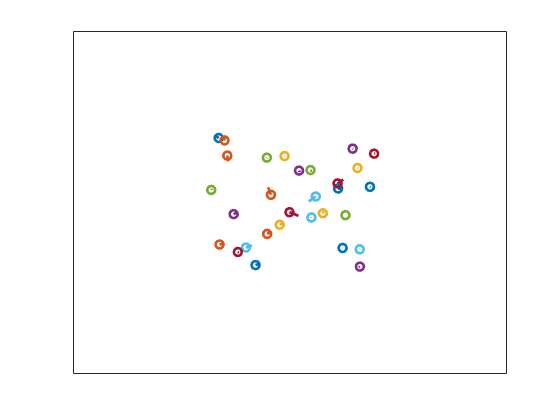
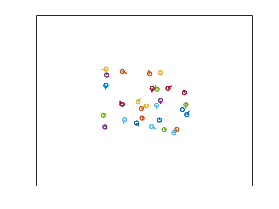
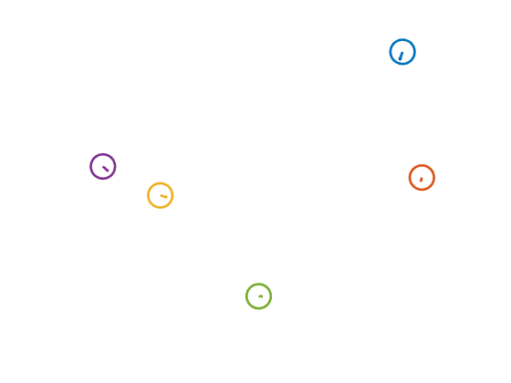
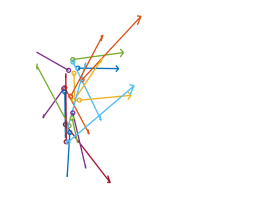

# Modelling-Emergence-in-Flocks
Supplementary Information for my MA4K8 Project.

Included are codes for a MATLAB implementation of the Boids model, the Cucker-Smale model & the augmented Cucker-Smale model. Below are animated quiver plots of the various models. All plots are done in R^2 but the code can easily be updated to work in any dimension (in particular, convergence results hold in the CS model regardless of dimension).

# Boids

The Boids model implemented is a gross simplification of the one devised by Craig Reynolds (https://www.red3d.com/cwr/code/boids.lisp). It implements the three basic rules of Boids: Cohesion, Coalignment and Collision Avoidance, along with "soft" boundary conditions that ensure the boids stay in the prescribed square.

Higher cohesion:

Higher collision avoidance:

A closer look at behaviour (without boundary conditions)

# Cucker-Smale Model

This is a MATLAB implementation of the discrete Cucker-Smale (CS) model, which can be seen as a first-order approximation of the continuous CS model.

In the following animation agents were uniformly randomly distributed

 

# Augmented Cucker-Smale Model

